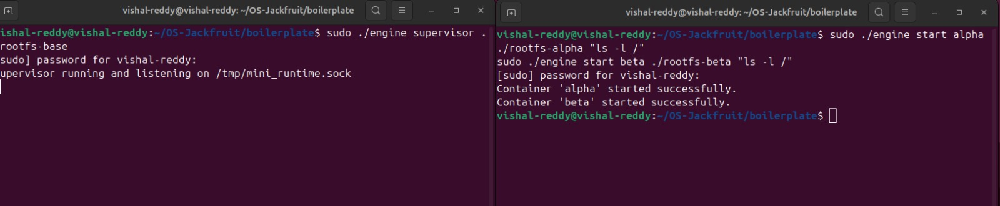
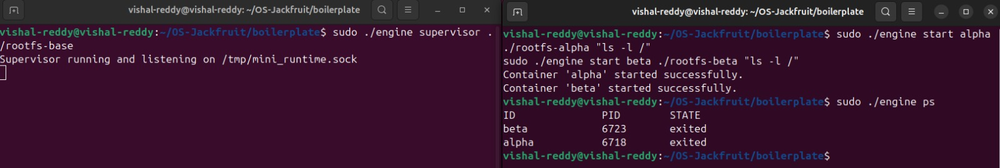
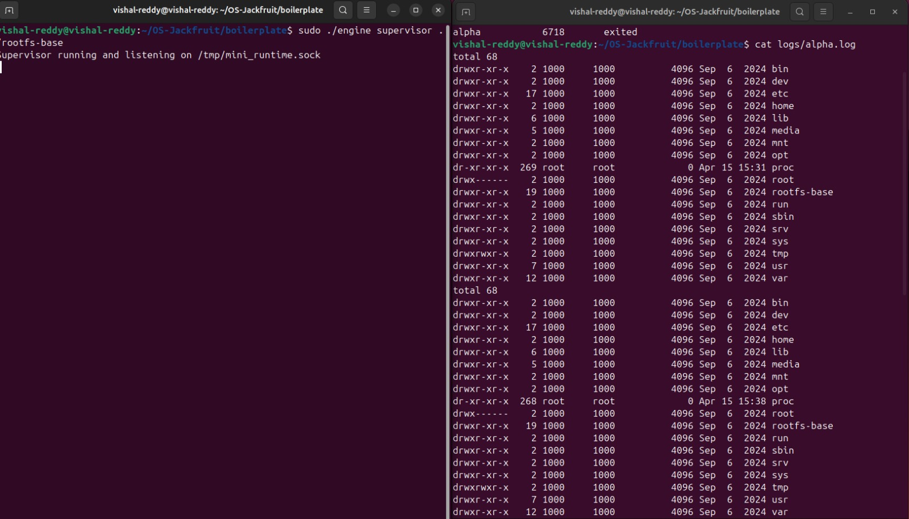
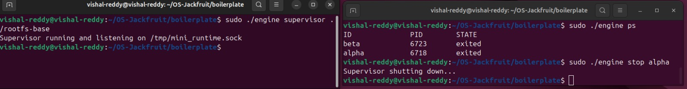
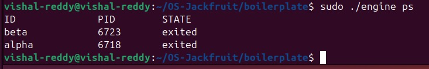
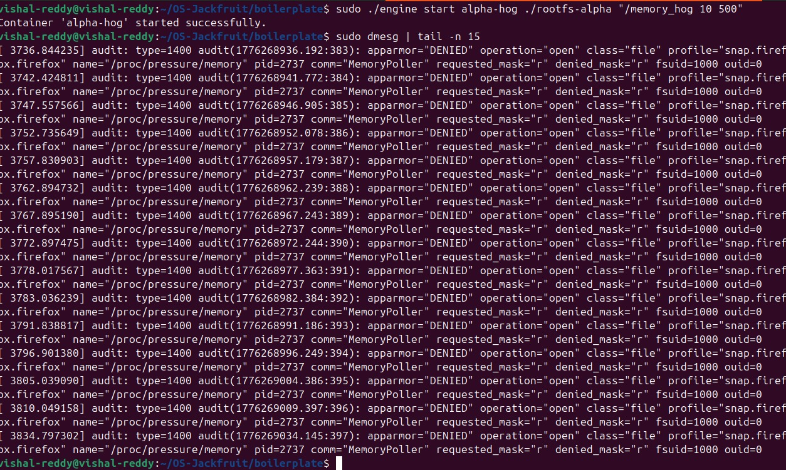
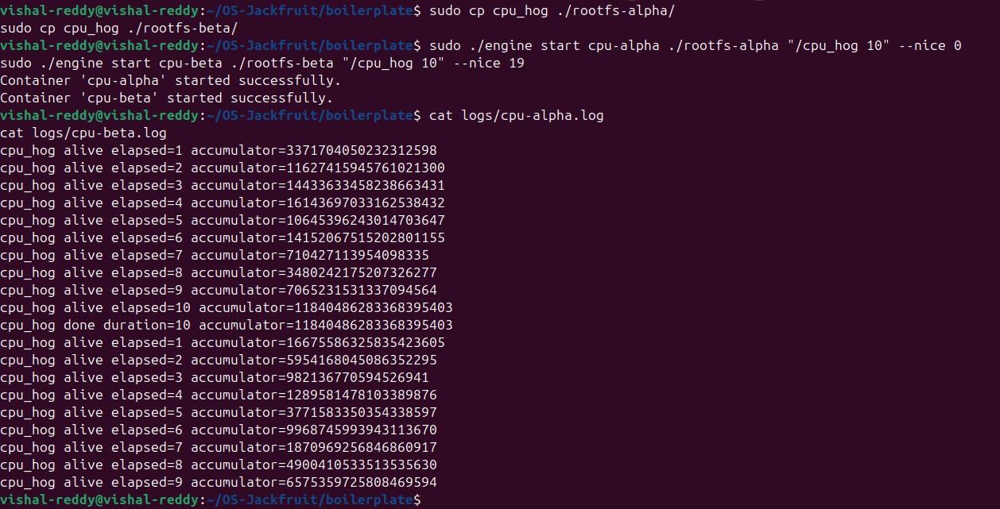
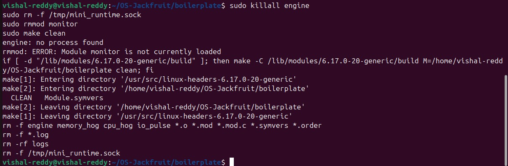

# Mini Container Runtime in C

## Description
This project implements a lightweight container runtime similar to Docker using C. It demonstrates process isolation using Linux namespaces and chroot, along with memory monitoring using a kernel module.

## Features
- Container creation using clone()
- Filesystem isolation using chroot()
- Supervisor process for managing containers
- Logging system using producer-consumer model
- Kernel module for memory monitoring (RSS tracking)

## Concepts Used
- Namespaces (PID, UTS, Mount)
- chroot()
- clone()
- IPC (pipe, socket)
- Synchronization (mutex, condition variables)
- Memory management (RSS)
- CPU scheduling (nice values)

##Commands

Start supervisor:
./engine supervisor ./rootfs-base

Start container:
./engine start alpha ./rootfs-alpha /bin/sh

List containers:
./engine ps

View logs:
./engine logs alpha

Load kernel module:
sudo insmod monitor.ko

Check logs:
dmesg | tail

##  Experiments
- Memory Enforcement using memory_hog
- CPU Scheduling using cpu_hog

## 💻 Author
Vikhyath bharadwaj k s and vishal 
## 📸 Screenshots

### Supervisor Running

### Container Execution

### Process Listing

### Logs Output

### Memory Monitoring

### Kernel Messages

### CPU Scheduling

### Final Output

